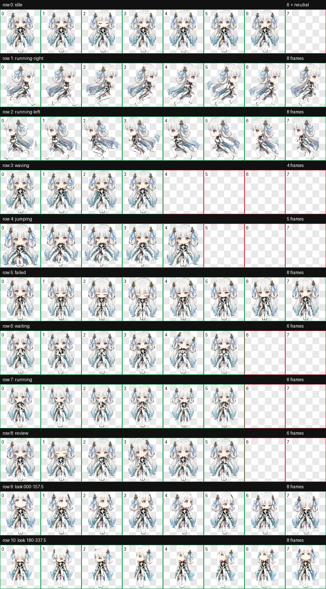

# Codex Pets

这里收录可直接加载到 Codex 的 v2 动画宠物。每个宠物目录至少包含 `pet.json` 与 `spritesheet.webp`，复制到 `~/.codex/pets/<pet-id>/` 后即可使用。

## 今汐（Jinhsi）

今汐是以《鸣潮》角色今汐为灵感制作的 Q 版人形贴纸风宠物。造型保留了白金长发、青绿色服饰、龙角与飘带等辨识特征，并为 Codex 的待机、移动、挥手、跳跃、失败、等待、执行和审阅状态制作了完整动画。



### 特点

- Codex v2 宠物格式，`spriteVersionNumber: 2`
- 9 组标准状态动画和 16 个顺时针观察方向
- Q 版人形贴纸风，透明背景
- `1536 x 2288` RGBA WebP 精灵表
- 已通过尺寸、透明度、单元格完整性与方向语义验证

### 安装今汐

#### macOS / Linux

```bash
mkdir -p ~/.codex/pets/jinhsi
cp outputs/jinhsi/pet.json ~/.codex/pets/jinhsi/
cp outputs/jinhsi/spritesheet.webp ~/.codex/pets/jinhsi/
```

#### Windows PowerShell

```powershell
$target = Join-Path $HOME ".codex\pets\jinhsi"
New-Item -ItemType Directory -Force -Path $target | Out-Null
Copy-Item "outputs\jinhsi\pet.json" $target
Copy-Item "outputs\jinhsi\spritesheet.webp" $target
```

安装完成后重启 Codex，在宠物列表中选择“今汐”。

相关文件：

- [宠物配置](outputs/jinhsi/pet.json)
- [16 方向预览](outputs/jinhsi/look-directions.png)
- [图集验证结果](outputs/jinhsi/validation.json)

---

## Sparkscribe

Sparkscribe 是一个为 Codex 制作的 v2 动画宠物。它是一只青绿色的灵感精灵，拥有温暖的奶油色脸庞和与身体相连的铅笔尾巴，代表把灵感变成可复用工具的创造过程。


### 特点

- Codex v2 宠物格式，`spriteVersionNumber: 2`
- 9 组标准状态动画和 16 个观察方向
- 待机时眨眼并出现轻微的灵感亮灯
- 等待输入时会期待、短暂打盹，然后醒来
- 执行任务时使用铅笔尾巴进行速写
- 审阅结果时会前倾、眯眼、眨眼和歪头
- `1536 x 2288` RGBA WebP 精灵表
- 已通过尺寸、透明度、动作完整性和主方向盲测

### 安装

安装时只需要下面两个文件：

```text
outputs/sparkscribe-enhanced/
├── pet.json
└── spritesheet.webp
```

#### macOS / Linux

在仓库根目录运行：

```bash
mkdir -p ~/.codex/pets/sparkscribe
cp outputs/sparkscribe-enhanced/pet.json ~/.codex/pets/sparkscribe/
cp outputs/sparkscribe-enhanced/spritesheet.webp ~/.codex/pets/sparkscribe/
```

#### Windows PowerShell

在仓库根目录运行：

```powershell
$target = Join-Path $HOME ".codex\pets\sparkscribe"
New-Item -ItemType Directory -Force -Path $target | Out-Null
Copy-Item "outputs\sparkscribe-enhanced\pet.json" $target
Copy-Item "outputs\sparkscribe-enhanced\spritesheet.webp" $target
```

安装完成后重启 Codex。Sparkscribe 会由 Codex 根据当前状态自动播放对应动作，无需单独启动程序。

### 文件说明

| 文件 | 用途 |
| --- | --- |
| `pet.json` | 宠物名称、描述、格式版本及精灵表路径 |
| `spritesheet.webp` | Codex 实际加载的 v2 动画图集 |
| `contact-sheet-extended.png` | 11 行动画的完整预览 |
| `look-directions.png` | 16 个观察方向的标注预览 |
| `validation-extended.json` | 图集尺寸、透明度和单元格验证结果 |
| `enhancement-summary.json` | 本次动作增强摘要 |
| `run-summary.json` | 生成、验证和安装产物索引 |

### 动作映射

| 行 | 状态 | 帧数 | 表现 |
| --- | --- | ---: | --- |
| 0 | `idle` | 6 | 安静待机、眨眼、灵感亮灯 |
| 1 | `running-right` | 8 | 向右移动 |
| 2 | `running-left` | 8 | 向左移动 |
| 3 | `waving` | 4 | 挥手问候 |
| 4 | `jumping` | 5 | 跳跃 |
| 5 | `failed` | 8 | 失败或取消反应 |
| 6 | `waiting` | 6 | 等待输入、打盹、醒来 |
| 7 | `running` | 6 | 使用铅笔尾巴专注工作 |
| 8 | `review` | 6 | 仔细审阅结果 |
| 9-10 | `look` | 16 | 顺时针观察方向，从 `000` 到 `337.5` |

### 兼容性

该宠物需要支持 Codex v2 宠物图集的版本。清单中的 `spriteVersionNumber` 必须保持为 `2`，并且 `pet.json` 与 `spritesheet.webp` 必须位于同一个 `sparkscribe` 目录中。

### 验证

最终图集验证结果：

- 尺寸：`1536 x 2288`
- 单元格：`192 x 208`
- 布局：8 列 x 11 行
- 格式：RGBA WebP
- 透明 RGB 残留：0
- 验证错误：0

更多细节见 [validation-extended.json](outputs/sparkscribe-enhanced/validation-extended.json)。
