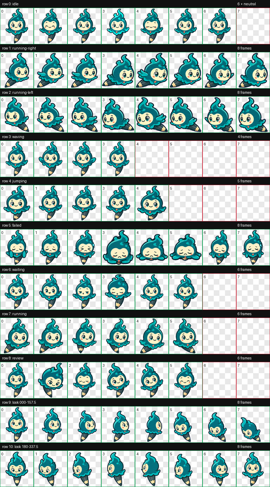

# Sparkscribe

Sparkscribe 是一个为 Codex 制作的 v2 动画宠物。它是一只青绿色的灵感精灵，拥有温暖的奶油色脸庞和与身体相连的铅笔尾巴，代表把灵感变成可复用工具的创造过程。



## 特点

- Codex v2 宠物格式，`spriteVersionNumber: 2`
- 9 组标准状态动画和 16 个观察方向
- 待机时眨眼并出现轻微的灵感亮灯
- 等待输入时会期待、短暂打盹，然后醒来
- 执行任务时使用铅笔尾巴进行速写
- 审阅结果时会前倾、眯眼、眨眼和歪头
- `1536 x 2288` RGBA WebP 精灵表
- 已通过尺寸、透明度、动作完整性和主方向盲测

## 安装

安装时只需要下面两个文件：

```text
outputs/sparkscribe-enhanced/
├── pet.json
└── spritesheet.webp
```

### Windows PowerShell

在仓库根目录运行：

```powershell
$target = Join-Path $HOME ".codex\pets\sparkscribe"
New-Item -ItemType Directory -Force -Path $target | Out-Null
Copy-Item "outputs\sparkscribe-enhanced\pet.json" $target
Copy-Item "outputs\sparkscribe-enhanced\spritesheet.webp" $target
```

### macOS / Linux

在仓库根目录运行：

```bash
mkdir -p ~/.codex/pets/sparkscribe
cp outputs/sparkscribe-enhanced/pet.json ~/.codex/pets/sparkscribe/
cp outputs/sparkscribe-enhanced/spritesheet.webp ~/.codex/pets/sparkscribe/
```

安装完成后重启 Codex，在宠物列表中选择 Sparkscribe。

## 文件说明

| 文件 | 用途 |
| --- | --- |
| `pet.json` | 宠物名称、描述、格式版本及精灵表路径 |
| `spritesheet.webp` | Codex 实际加载的 v2 动画图集 |
| `contact-sheet-extended.png` | 11 行动画的完整预览 |
| `look-directions.png` | 16 个观察方向的标注预览 |
| `validation-extended.json` | 图集尺寸、透明度和单元格验证结果 |
| `enhancement-summary.json` | 动作增强摘要 |
| `run-summary.json` | 生成、验证和安装产物索引 |

## 动作映射

| 行 | 状态 | 帧数 | 表现 |
| --- | --- | ---: | --- |
| 0 | `idle` | 6 | 安静待机、眨眼、灵感亮灯 |
| 1 | `running-right` | 8 | 向右移动 |
| 2 | `running-left` | 8 | 向左移动 |
| 3 | `waving` | 4 | 挥手问候 |
| 4 | `jumping` | 5 | 跳跃 |
| 5 | `failed` | 8 | 失败或取消反应 |
| 6 | `waiting` | 6 | 等待输入、打盹、醒来 |
| 7 | `running` | 6 | 使用铅笔尾巴专注工作 |
| 8 | `review` | 6 | 仔细审阅结果 |
| 9-10 | `look` | 16 | 从 `000` 到 `337.5` 顺时针观察 |

## 验证

- 尺寸：`1536 x 2288`
- 单元格：`192 x 208`
- 布局：8 列 × 11 行
- 格式：RGBA WebP
- 透明 RGB 残留：0
- 验证错误：0

更多细节见 [validation-extended.json](validation-extended.json)，16 方向效果见 [look-directions.png](look-directions.png)。
